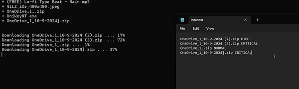

# File Transfer Program 



This is a small project for the **Computer Networking** course i took. Its goal is to create a **Server-Client** program for file transfering with 2 parts, each part has different requirements:
- **Part I**:
    - **Server**: Can only handle 1 Client at a time.
    - **Client**: Can only download 1 file at a once.
- **Part II**:
    - **Server**: Can handle multiple Clients at once.
    - **Client**: Can download multiple files, with priorities.


> Honestly, I had a pretty rough time coding this project. Since, I had to learn **Python** (cuz i wanna try it out) and other stuffs about **Socket Programming**.
## Libraries Used

- **`import socket`**: used to create and setting up a **TCP/IP connection** between Client and Server, allowing them to communicate over a network.
- **`import os`**: used for **interacting with the Operating System**, such as changing the working directory, fetching file’s size and creating folders.
- **`import time`**: used for delaying the printing of progress bar in **Part I** and the checking of `input.txt` file in **Part II**.
- **`import threading`**: allows the Server to **handle multiple Clients simultaneously**. Each Client can be managed in a separate thread, ensuring the server remains responsive.

## How It Works

### Part I

- Server accepts Client.
- Client constantly check if the `input.txt` file has changed.
- If so, create a `request_list` using the `input.txt` file.
- Send each request to the Server.
- Server receives request, fetch file’s size (for progress bar) and whole data. Send them to the Client.
- Client receives file’s size and file’s data. Create the file based on the received data.

### Part II

- Server create a `Accept_Thread` thread with the objective of accepting connections.
- `Accept_Thread` thread accepts Client, creates a `CThread` thread for each Client. (`CThread` thread purpose is to handle a Client)
- Client check if there's new request(s) in the `input.txt` file every 2 seconds.
- If so, add them to the `request_dictionary`.
- As long as the `request_dictionary` is not empty, loop through each request in the dictionary.
- With each iteration, the Client will receives a part of the the file’s data, creating the illusion of multiple files downloading. 


## How To Use

### Prerequisites
Before you begin, make sure you have the followings:
- `Python 3.12.7` or newer.
- Client and Server files.
- Connection to the Internet.
- An IDE or Code Editor.

### Setting Up

#### For the Client
- Open the Client `.py` file.
- Find the `Server_IP` variable and change its value to the Server IPV4 address.
- Create an empty `input.txt` file.

#### For the Server
- Create a `files` folder.
- Put all of the allowed-for-download files in there.
- Create a `list.txt` file, fill it with the names of the files in the `files` folder **(each name on a new line)**.

### Running
- Run the Server first
```python
python 01_Server.py
```
```python
python 02_Server.py
```
- Then the Client can run
```python
python 01_Client.py
```
```python
python 02_Client.py
```
- The Client can now open the `input.txt` file and type in their requests.
```
Prototype of the input.txt:
Part I:
    File1
    File2
    ...
    FileN
Example:
    RickRoll.mp4
    UniKeyNT.exe
    Banana.jpg

Part II:
    File1 PRIORITY1
    File2 PRIORITY2
    ...
    FileN PRIORITYN
Example:
    RickRoll.mp4 NORMAL
    UniKeyNT.exe HIGH
    Banana.jpg CRITICAL
```
### Termination
- Client can stop by pressing `Ctrl+C` (only after they have finished downloading all the files).
- Server can only be turn off by closing the **Terminal**.
